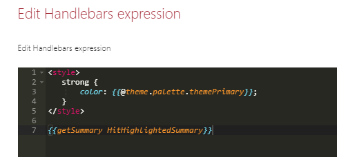
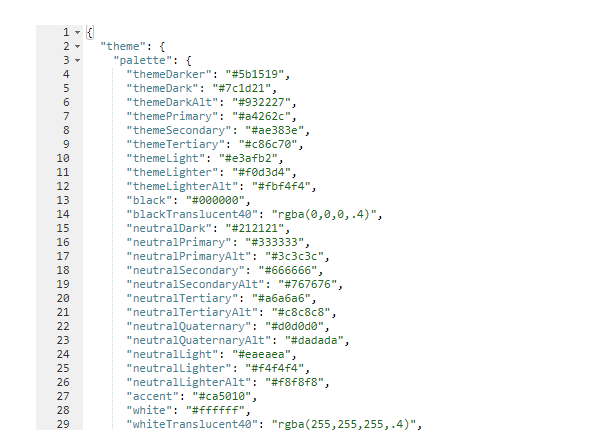

# Customize layout templates with HTML, CSS and Handlebars

In a basic customization scenario, super users and webmasters can customize existing templates or start from a blank template to adapt the UI to their requirements.  Templates use [Handlebars](https://handlebarsjs.com/) to display data retrieved from the data source. There are several options to customize a template:

- Use regular HTML markup, Handlebars syntax and [helpers](#handlebars-helpers).
- [Use default web components provided by the solution](#using-builtin-web-components).
- [Write custom CSS styles](#custom-css-styles).
- [Use Microsoft Graph Toolkit components](#microsoft-graph-toolkit).

> The templates and fields HTML markup is sanitized automatically preventing XSS attacks. We used [`DOMPurify`](https://github.com/cure53/DOMPurify) to do so. It means for instance, you cannot add your own `<script>` tags or inline JavaScript.

## Template structure

A layout template is always split into two distinct parts:

```html
    <content id="template">
        <!-- Your template content here -->
    </content>

    <content id="placeholder">
        <!-- Your placeholder content here -->
    </content>
```
- A `template` part, containing the HTML markup to display your data **once fetched**. This part is mandatory to display your data.

- A `placeholder` part, containing the HTML markup to display as placeholder **while the data are getting fetched**. This part is optional.

Both can use Handlebars and web components (Microsoft Graph Toolkit included). 

## Handlebars helpers

The following custom helpers are available in addition to the [handlebars-helpers](https://github.com/helpers/handlebars-helpers). If those don't do the job for you, you can still write your own using the [extensibility library](./handlebars_customizations.md).

> The `markdown` and `logging` helpers are not available. For `times` use `multiply` as `times` is a custom iterator.

| Helper | Description | Example |
| ------ | ----------- | -------- |
| `{{getGraphPreviewUrl "<absolute_URL>"` | Try to determine the preview URL based on an absolute URL using the unified Microsoft Graph URL syntax. For instance, _https://aequosdev.sharepoint.com/sites/dev/Shared%20Documents/MyDocument.pdf_ becomes _https://aequosdev.sharepoint.com/sites/dev/Shared%20Documents/?id=/sites/dev/Shared%20Documents/MyDocument.pdf&parent=/sites/dev/Shared%20Documents_  | `{{getGraphPreviewUrl 'https://aequosdev.sharepoint.com/sites/dev/Shared%20Documents/MyDocument.pdf'}}`
`{{getCountMessage <total items count> <?keywords>}}` | Display a friendly message displaying the result and the entered keywords. | `{{getCountMessage 5 'contoso'}}` will display _'5 results for 'contoso'_.
| `{{getSummary "<value>"}}` | _Use with SharePoint Search data source and the HitHighlightedSummary SharePoint search managed property_. Returns the formatted value for rendering. | `{{getSummary HitHighlightedSummary}}`
| `{{getDate <data_value> "<format>" <time handling>}}` | Format the date with [Moment.js](https://momentjs.com/docs/#/parsing/string-format/) according to the current language. Date in the managed property should be on the form `2018-09-10T06:29:25.0000000Z` for the function to work.<p>&lt;time handling&gt; is optional and takes <ul><li>0 = format to browsers time zone (default)</li><li>1 = ignore Z time and handle as browsers local time zone</li><li>2 = strip time and set to 00:00:00 in browsers local time zone</li><li>3 = display in the time zone for the current web</li><li>4 = display in the time zone from the uers profile</li> | `{{getDate 2018-09-10T06:29:25.0000000Z 'LL'}}`
| `{{getUrlField <managed_propertyOWSURLH> "URL|Title"}}` | _Use with SharePoint Search data source_. Returns the URL or Title part of a URL autocreated managed property | `{{getUrlField MyPropertyOWSURLH "Title"}}`
`{{getUniqueCount items "<property>"}}` or  `{{getUniqueCount array}}`| Get the unique count of a property over the result set (or another array) or get the unique count of objects in an array. Example: [1,1,1,2,2,4] would return `3`. | `{{getUniqueCount [1,1,1,2,2,4]}}`
`{{getUnique items "<property>"}}` | Return the unique values as a new array based on an array or property of an object in the array. | `{{getUnique items "NewsCategory"}}`
`{{#group items by="<property>"}}` | Group items by a specific results property. See [https://github.com/shannonmoeller/handlebars-group-by](https://github.com/shannonmoeller/handlebars-group-by) for usage.
| `{{slot item <property_name>}}` | Return the `<property_name>` value for the `item` object. Supports deep property paths. | `{{slot item "property.subproperty"}}`
| `{{getUserEmail <value>}}` | Extract the user email in a string based on a email regex  (ex: a claim). Returns the first match.| `{{getUserEmail "franck.cornu@aequosdev.onmicrosoft.com | Franck Cornu | 693A30232E667C6D656D626572736869707C6672616E636B2E636F726E7540616571756F736465762E6F6E6D6963726F736F66742E636F6D i:0#.f|membership|franck.cornu@aequosdev.onmicrosoft.com"}}`
| `{{#times <number>}}` | Iterate the block `<number>` times. | `{{#times 5}} some mark up  {{/times}}`
| `{{regex <expression> <string>}}` | Run a regular expression and return the match. Return `-` if not match. | `{{regex '\d+' 'digit 15 is a number'}}` will return `15`.
| `{{getPageContext "<SPFx page property>"}}` | Retrieve a property from the SPFx context object. | `{{getPageContext "user.displayName"}}` or `{{getPageContext "cultureInfo.currentUICultureName"}}`
| `{{getAttachments}}`| Return object structure for list item attachments. | `{{#getAttachments LinkOfficeChild}}<a href="{{url}}">{{index}} - {{fileName}}</href>{{/getAttachments}}`


> Need any other helper? Let us know [here](https://github.com/aequos-solutions/modern-search-results/issues)!

## Using builtin web components

By default, several components are available ([see the complete list](./web_components_list.md)). If these does not fit your requirement, you can still create your own using the [extensibility library](./custom_web_component.md).

## Custom CSS styles

Inside an HTML template (or layout field), you can write your own CSS styles using a &lt;style&gt; tag. Even better, you can inject Handlebars variables, helpers, conditional blocks, etc. right inside it and get dynamic classes or attributes

```html
<content id="data-content">

    <style>

        .example-themePrimary a {
            color: {{@root.theme.palette.themePrimary}};
        }

        ...
        
    </style>

    <div class="template">
        ...
    ...
```

However, all CSS rules (including `@media` rules) will be all prefixed automatically by an unique ID (**pnp-template_&lt;Web Part instance ID&gt;**) to make sure styles are isolated from other Web Parts on the page. We do this to avoid conflicts between classes in the global context.

## Use SharePoint theme in your templates

If you need to use current site theme colors, fonts and so on you can use the `theme` property available in the `@root` Handlebars context like this:

```html
<content id="data-content">

        <style>
            .example-themePrimary {
                color: {{@root.theme.palette.themePrimary}};
            }
            ...
        </styles>

        ...

        <span class="example-themePrimary">{{Title}}</span>

        ...

</content>
```

> You can also use this variable in the 'Details List' and 'Cards' layouts in field expresions.



A good way to see all available values for the current theme is to switch to the debug layout and inspect these values:



## Work with placeholders

To indicate the data are loading, you can create placeholders (shimmers) using the `<content id="placeholder-content">` section of your HTML template:
The placeholder is only loaded during first data load. For subsequent requests, a overlay will be displayed.

```
<content id="placeholder-content">

    <style>

        .placeholder .icon {
            width: 20px;
            height: 16px;
            margin-right: 5px;
        }

        .placeholder ul {
            list-style: none;
        }

        .placeholder ul li {
            display: flex;
            align-items: center;
            padding: 8px;
        }
            
    </style>

    <div class="placeholder">
        <ul>
            {{#times 5}}   
                <li>
                    <div class="icon placeholder--shimmer"></div>
                    <span class="placeholder--shimmer placeholder--line" style="width: 60%"></span>                
                </li>
            {{/times}}
        </ul>
    </div>
</content>
```

Use CSS classes `placeholder--shimmer` and `placeholder--line` to build your placeholders. Basically, you can reuse the same HTML structure as your template content markup, but using these these classes instead to fill areas.

If no placeholder is present in the template, a default one will be loaded.

## Microsoft Graph Toolkit

> The Microsoft Graph Toolkit is a collection of reusable, framework-agnostic web components and helpers for accessing and working with Microsoft Graph. The components are fully functional right of out of the box, with built in providers that authenticate with and fetch data from Microsoft Graph.

In the solution, you can use Graph Tookit components whitout the need to re-authenticate against Microsoft Graph because the Web Parts already use the [SharePoint provider](https://docs.microsoft.com/en-us/graph/toolkit/providers/sharepoint).

Refer to the official documentation to see [all available components](https://docs.microsoft.com/en-us/graph/toolkit/components/login). For instance, we use the Microsoft Graph Toolkit for the [people layout](../usage/search-results/layouts/people.md) via `<mgt-person>`.
