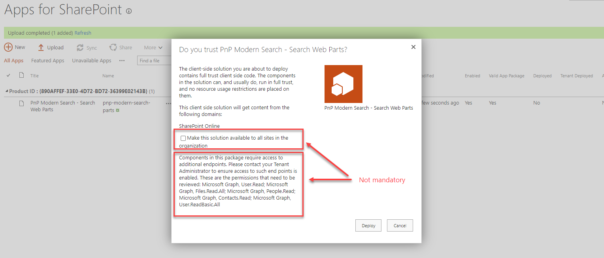

# Installation

1. Download the latest SharePoint Framework packages **pnp-modern-search-parts.sppkg** and **pnp-modern-search-extensibility.sppkg** from the [GitHub repository](https://github.com/microsoft-search/pnp-modern-search/releases).
2. Add the packages to your global app catalog or site collection app catalog. If you don't have an app catalog, follow this [procedure](https://docs.microsoft.com/en-us/sharepoint/use-app-catalog) to create one.

    **You must deploy the two SPFx packages to get it work.**

    {: .center}

    > * The packages are deployed in the general Office 365 CDN meaning **we don't host any code**.

    > * For the **pnp-modern-search-parts.sppkg** package, you can choose to make the solution available in [all sites](https://docs.microsoft.com/en-us/sharepoint/dev/spfx/tenant-scoped-deployment) or force to install an app to the site every time.

    > * The solution asks the following API permissions by default to enhance the experience. These permissions are **not mandatory**. If you don't accept them, you will simpy have less available features.

    | Requested API permission | Used for |
    | -------------- | --------- |
    | _User.Read_ | The Microsoft Graph Toolkit [persona card](https://docs.microsoft.com/en-us/graph/toolkit/components/person-card#microsoft-graph-permissions) in the people layout.  |
    | _People.Read_ | Same as above.
    | _Contacts.Read_ | Same as above.
    | _User.ReadBAsic.All_ | Same as above.

3. Add the Web Parts to a SharePoint and start building!

{: .center}