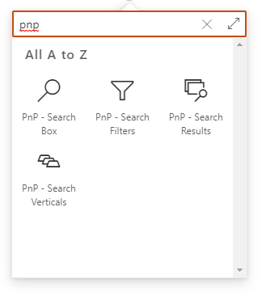
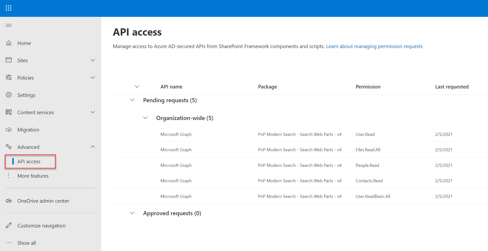
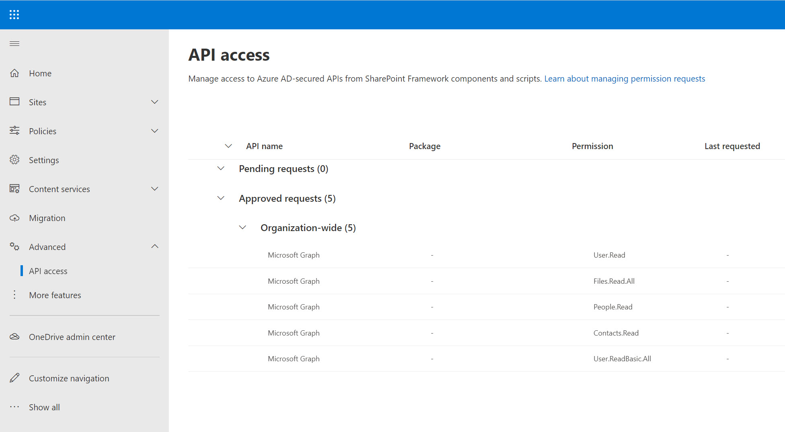

# Installation

1. Download the latest SharePoint Framework packages **pnp-modern-search-parts.sppkg** and **pnp-modern-search-extensibility.sppkg** from the [GitHub repository](https://github.com/microsoft-search/pnp-modern-search/releases).
2. Deploy **pnp-modern-search-extensibility.sppkg** to the global tenant app catalog, and ensure you check "Make this solution available to all sites in the organization". This is currently a limitation of SPFx libraries - but should not be an issue as it cannot work by itself, and poses no security risk. If you don't have an app catalog, follow this [procedure](https://docs.microsoft.com/en-us/sharepoint/use-app-catalog) to create one.
2. Add **pnp-modern-search-parts.sppkg** to the global teant app catalog or a site collection app catalog. 

    **You _must_ deploy both SPFx packages to get a working solution.**

    {: .center}

    > * The packages are deployed in the general Office 365 CDN meaning **we don't host any code**.

    > * For the **pnp-modern-search-parts.sppkg** package, you can choose to make the solution available in [all sites](https://docs.microsoft.com/en-us/sharepoint/dev/spfx/tenant-scoped-deployment) or force to install an app to the site every time.

    > * The solution asks the following API permissions by default to enhance the experience. These permissions are **not mandatory**. If you don't accept them, you will simply have less available features.

    > * You can approve scopes from the API Access screen in the SharePoint Admin Center: https://&lt;tenant&gt;-admin.sharepoint.com/_layouts/15/online/AdminHome.aspx#/webApiPermissionManagement If you'd like more details on this step, please see the [Approving Scopes](#approving-scopes) section below.

    | Requested API permission | Used for |
    | -------------- | --------- |
    | _User.Read_ | The Microsoft Graph Toolkit [persona card](https://docs.microsoft.com/en-us/graph/toolkit/components/person-card#microsoft-graph-permissions) in the people layout.  |
    | _People.Read_ | Same as above.
    | _Contacts.Read_ | Same as above.
    | _User.ReadBasic.All_ | Same as above.
    | _Files.Read.All_ | Allow search for files using Graph API (Drive / Drive Items).
    | _Mail.Read_ | Allow search for user's e-mail using Graph API (Messages).
    | _Calendars.Read_ | Allow search for user's calendar appointments using Graph API (Events).
    | _Sites.Read.All_ | Allow search for sites using Graph API (Sites / List Items).
    | _ExternalItem.Read.All_ | Allow search for connector items using Graph API (External Items).

3. Add the Web Parts to a SharePoint and start building!

{: .center}

# Approving Scopes

You can approve the required scopes in the SharePoint Admin Center on the API Access page. When you visit that page, you will see any pending requests. The screenshot below shows the pending requests for the v4 solution.

{: .center}

You'll need to approve each request one at a time. If you have questions about what the requested scopes mean and what permissions they provide, check the article [Manage access to Azure AD-secured APIs](https://docs.microsoft.com/en-us/sharepoint/api-access).

After you approve each request your view will be as shown in the screenshot below.

{: .center}
