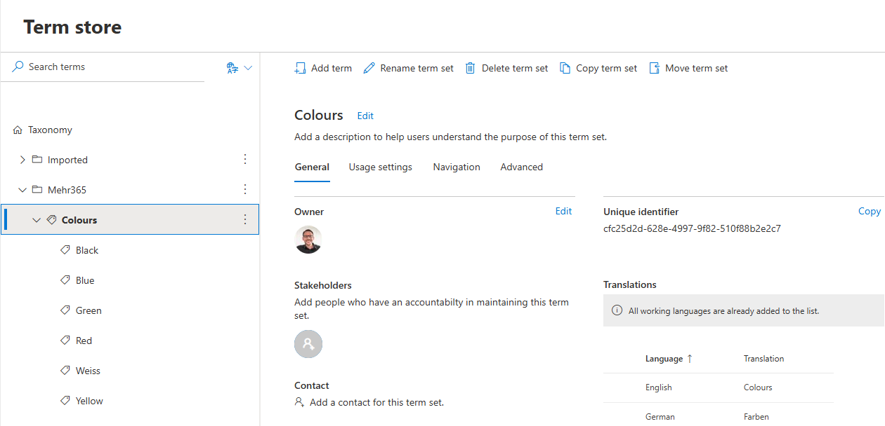
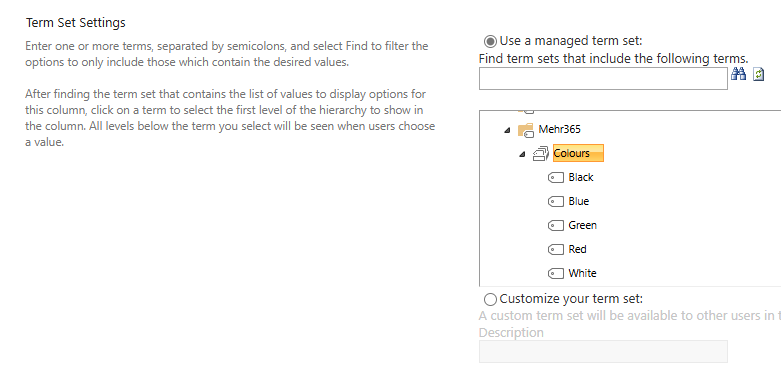
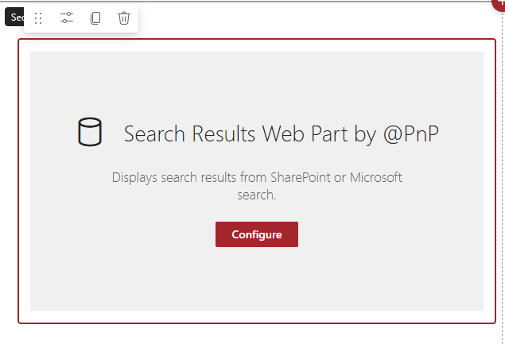
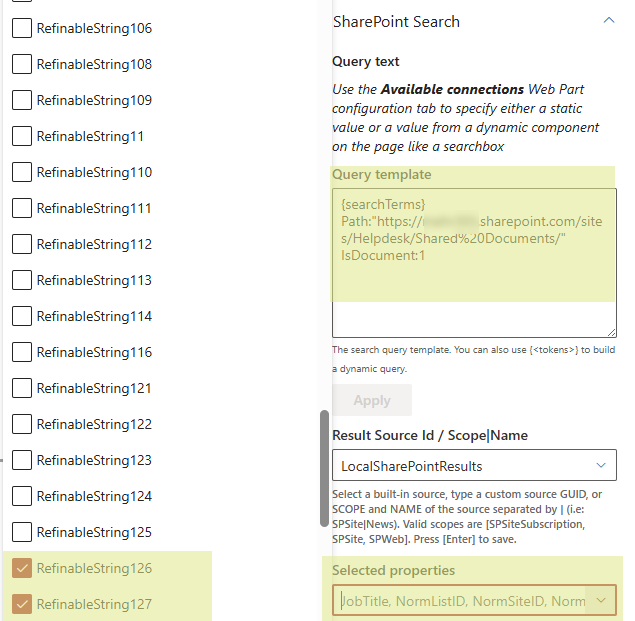
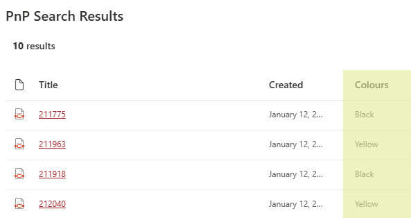
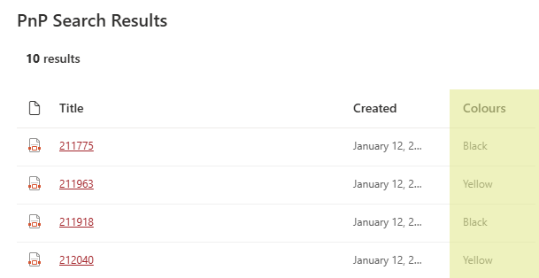

# Display Multilingual term store values with PnP Search Results

!!! note
    The PnP Modern Search Web Parts must be deployed to your App Catalog and activated on your site. See the [installation documentation](../installation.md) for details.
    
This scenario describes how term store values can be displayed in multiple languages in the PnP Modern Search.

## Prepare the scenario
I use the colours as example in my case, it's simple to understand in different languages. You need also 2 different users with different language settings for a quicklier testing. 

Create a SharePoint Term store and translate the terms into another language, i use english as a default language and german as work language. Translate every term within the term set. 

Create a SharePoint site column with type Managed Metadata and use the newly created term set.

Add the new site column to a SharePoint document library and tag your documents. 

When you check the library with your 2 different users, you can see SharePoint will be translate the multilingual term sets in the language from the user, where is logged in. SharePoint will be translate all default terms also in the other language, but not columns or views, but you can translate this terms manually.

Library in english:

Library in german:

As prepare for our search configuration, map the new crawled property to RefinableStringXX Managed Properties, please attention, map both Crawled properties, OWS_ and the OWS_TAXID_, to Managed Properties.

Now, we are ready to jump into our search scenario, let's go 🚀

## Add PnP Search Results WebPart to a page
Add the PnP Search Results WebPart to a new or existing site page. See the scenario how you can [create a simple search page](create-simple-search-page.md)

## Configure Search Results WebPart
Configure the new PnP Results WebPart with a SharePoint Search source and as simply as possible, with a path-query and add the new Managed Properties as Selected properties in the WebPart configuration.

Add the new Managed Property, with the OWS_, as Managed columns into the results WebPart and save the page.

Check the page with both users and different language settings and you can see, the terms will NOT translate into the languages, we can see the default language as column values.

## Configure multilingual columns
Edit the page and go back to Manage columns, activate the Use Handlebar expression and insert {{AutoRefinableString127}} , the second property mapped to the crawled property OWS_TAXID_, as expression.

Enable localization on the first page from the PnP Search Results configuration.

## Testing Search configuration
After saving the configuration, now you can see the translated values in the PnP Search Results WebPart in the different languages.

### Results in english

### Results in german

*A little multilingual disclaimer: The search columns or SharePoint WebPart titles are not multilingual, but you can use SharePoint Multilingual Pages to configure more in a different language. See more in the Microsoft article: 
