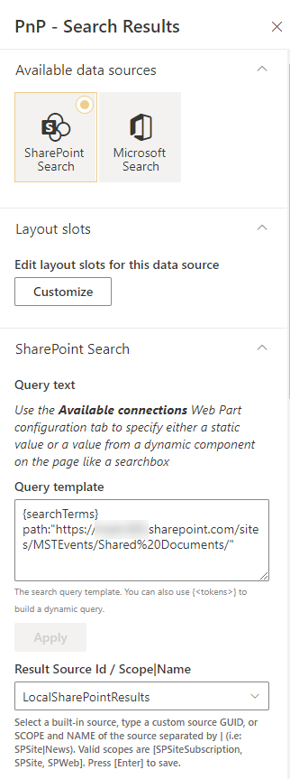
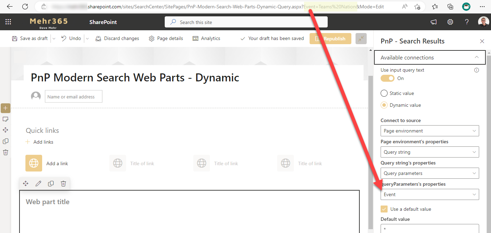
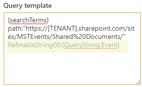
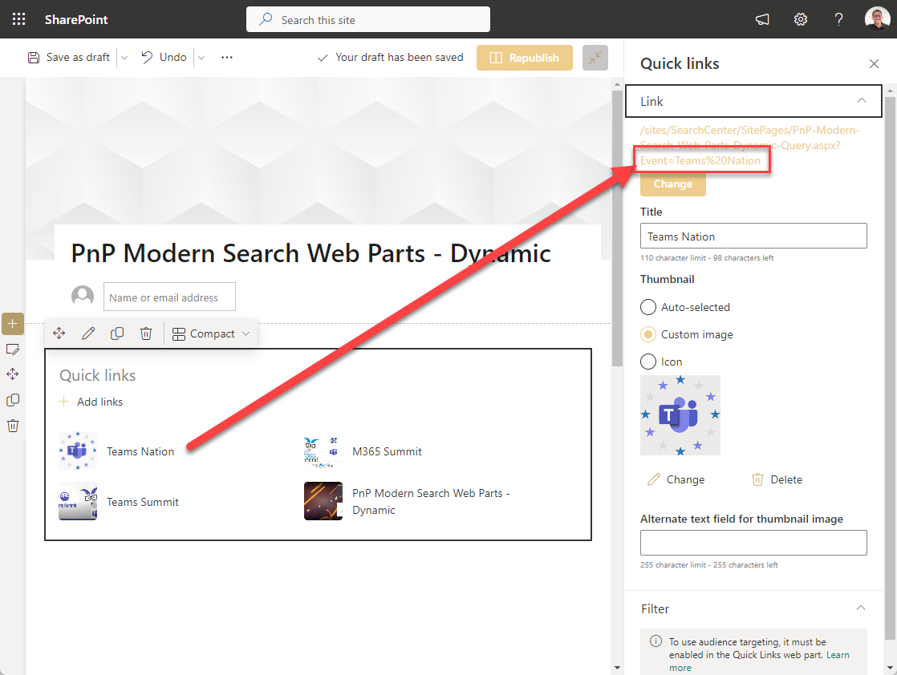
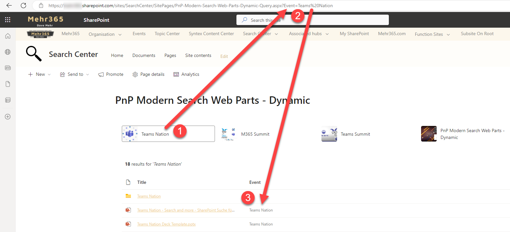

# Use query string from url for dynamic results

!!! note
    The PnP Modern Search Web Parts must be deployed to your App Catalog and activated on your site. See the [installation documentation](../installation.md) for details.
    
This scenario describes how to use query string as value in the URL from the current page. You can use URL query string parameters to build dynamic search pages.
Use a library with metadata that you can use the query string parameter in the URL. The value in the query string need to match with the metadata in the library.

## Create a new SharePoint page
To add the Search Web Parts, you must first create a new modern SharePoint page. We will be configure this new page as a search page with the PnP Modern Search Web Parts.

## Add PnP Search Web Parts
On the newly created page, add an SharePoint Quick links Web Part and one PnP Modern Search Web Part - Search Results. 

The Web Parts can be arranged and configured on the page as desired.

## Configure Search Results
Use the SharePoint Search as source and configure a query template. In this case i will show only documents from one library with metadata in the search results. Choose the existing default result source LocalSharePointResults.

### Layout configuration
You can use the default configuration.

## User Query String from URL
There are two options available to use the Query String parameter from the URL. You only need one of the options.

### Option 1
#### Configure Web Part Connections
Activate the "use input query text" connection in the existing Results Web Part. Configure "Page environment" as source, "Query string" as page environment property, "Query parameters" as query string property. 
You will miss the "Event" Query String from the URL on this time. Add your query string to the URL manually and your query string is available in the configuration. Use the query string "Event" in the queryParameters properties drop down in the Web Part configuration.

As example:
Full URL: https://[TENANT]/sites/[SITEURL]/SitePages/[PAGE].aspx?Event=Teams Nation&Mode=Edit
Query String: Event=
Value: Teams Nation

### Option 2
#### Query String in Query template
In Option two you can use Query template to "read" the Query string parameter direct from the URL. You don't need a configured web part connection as in option one.

## Add links with query string
After the Web Part configuration create quick links in the existing SharePoint Quicklinks Web Part and use links with the query string in the URL.

## Solution
After the links are created and saved, we are ready to test the scenario.

With a click (1) the URL is passed with the parameter (2) and the PnP Modern Search Results Web Part, with the connection, will read the query string value a show only documents with a matching (3).  

